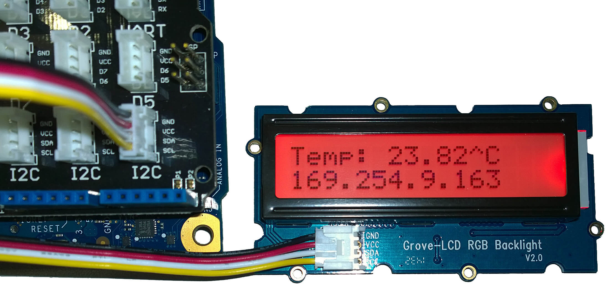
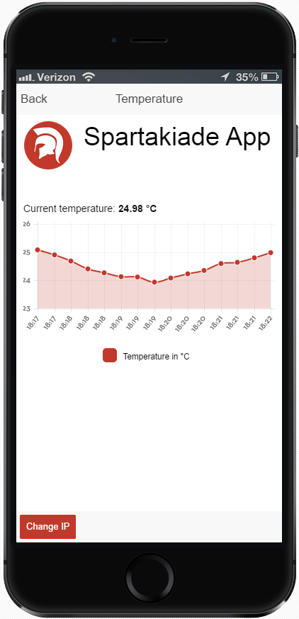

#Intel IoT on Galileo with mobile companion app

Welcome to the examples files from the last workshop. During the workshop we used the [Intel Development Kit for IoT (IoTDK)](https://software.intel.com/en-us/iot/devkit) to create and test applications for the Intel Galileo maker board. You can open and run both applications with the [Intel XDK IoT Edition](https://software.intel.com/en-us/html5/xdk-iot).

##[iotapp-local-temperature](iotapp-local-temperature)

This is [a fork of the Local Temperature Node.js sample application](https://github.com/gomobile/iotapp-local-temperature) distributed within Intel® XDK IoT Edition. The code was completely refactored.

This app shows how to run a node.js server on an Intel Galileo board. It uses a temperature sensor to periodically read the current room temperature. That temperature is shown on an LCD display. Additionally the server accepts WebSocket connections via socket.io. Connected clients will be periodically informed about the current temperature. 

##[iot-companion-spartakiade-app](iot-companion-spartakiade-app)

This is a full replacement for the original [Local Temperature Companion App](https://github.com/gomobile/sample-iot-companion-local-temperature).

The “Spartakiade App” is an hybrid app which runs on all smartphones. It utilizes Apache Cordova, AngularJS and the Ionic Framework. It connects to the node.js server and displays the last captured temperatures via chart.js. 

**
[« read more (German)](readme.md)**