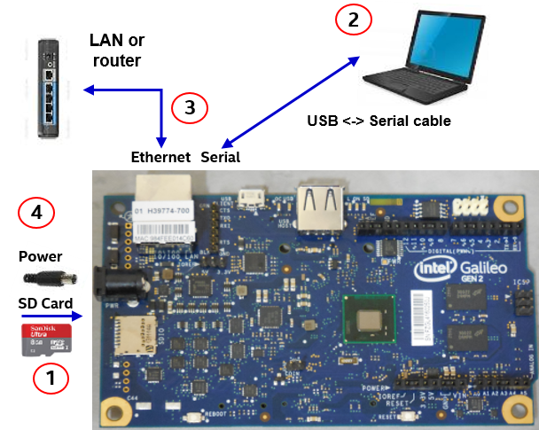
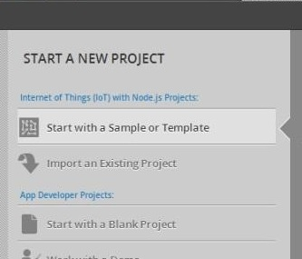
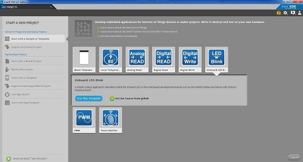
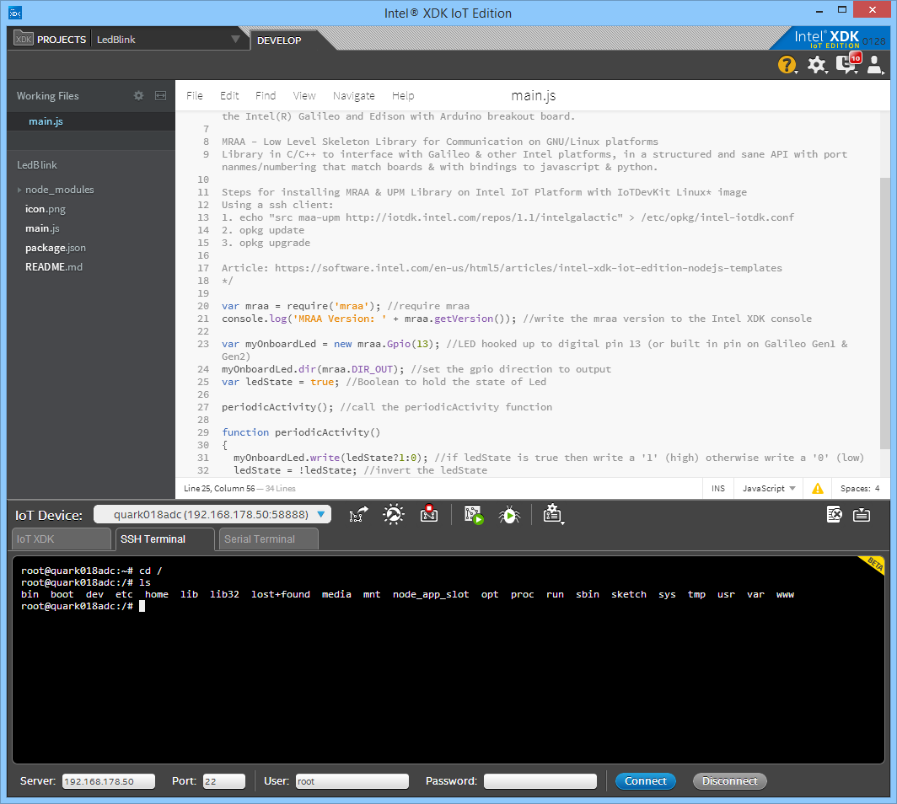
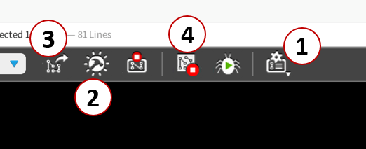
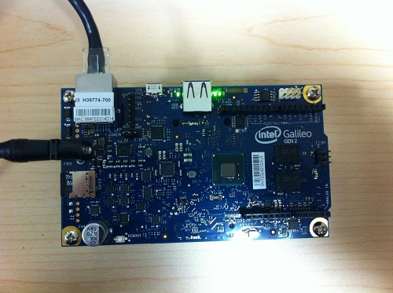

# Getting Started with Intel® XDK IoT Edition

This guide will let the onboard LED blink.

## Introduction

The [Intel Development Kit for IoT (IoTDK)](https://software.intel.com/en-us/iot/devkit) is a complete solution to create and test applications for Intel IoT platforms like the Intel® Galileo and Edison maker boards.

The complete IoTDK provides software and hardware component for developers to create innovative projects using the Galileo board and the Grove Starter Kit for starter. The software distributed with IoTDK comprises of **three** main parts: the **Intel® XDK IoT Edition**, the **Yocto** Linux system, and a set of **libraries**. These libraries were created to provide developers an easy way to control the hardware components integrated with Intel IoT platforms, as well as providing high level access to several sensors and actuators.

The **Yocto** Linux is a meta distribution specifically for embedded projects. It is a meta distribution because it is more than a Linux distribution - Yocto is an environment for producing tailored Linux-based operating systems. Yocto provides tools for selecting software packages, preparing settings and creating images that can be used to install this tailored OS.

The **Intel® XDK** IoT Edition lets you create and run applications directly on Intel IoT platforms. This edition of Intel® XDK also provides templates for creating new applications. Intel® XDK IoT Edition offers the possibility of remotely debugging your application, and running it from your own desktop.

The Yocto system installed on the Intel Galileo or Edison board provides a set of **libraries** especially designed for the IoTDK and the Intel® XDK IoT Edition. These libraries are **MRAA** and **UPM**. **MRAA** is a low level library that offers a translation from the General Purpose Input/Output interfaces to the pins available on Intel Galileo (or Edison). So instead of reading the raw level information from the GPIO module available on the Linux kernel, a developer can easily select a pin number and work directly with it. MRAA will take care of the underlying details. **UPM** is a repository of sensors representations, written in C++, and utilizing MRAA to do so. Both of these libraries have C++ bindings to JavaScript. With Intel® XDK IoT Edition, Node.JS is used to communicate with all of the GPIO Pins, libraries, and packages. For instance, the GPIO Pin 13 can be assigned with a useful line of code like var onboardLED = new mraa.Gpio(13);

## Setting Up the Intel® Galileo Gen 2 Board

### Intel Galileo Gen 2 Firmware Update
The Intel Galileo Gen 2 does not require a firmware update!!
Again, not firmware update! (as of 2015-02-21)

### Boot Image for Intel Galileo

Get the boot image from: [Boot-Image (207MB)](https://software.intel.com/sites/landingpage/iotdk/board-boot-image.html) We need to prepare the Intel Galileo board to be used with our IoTDK. As mention previously, this means starting the board with the prepared Yocto image from the SD card!

* [Windows](https://software.intel.com/en-us/node/530353)
* [Mac OS](https://software.intel.com/en-us/node/530415)
* [Linux](https://software.intel.com/en-us/node/532598)

**Hint: for this workshop Johannes prepared a couple of SD cards!**


## Connecting the Galileo Board to your desktop

1. Place the prepared micro-SD card in the micro-SD card slot on the Intel IoT platform
2. Connect the correspondent serial cable (FTDI for Gen2) in the appropriate port on the board. Connect the other side to an USB port on the desktop system.
3. Connect the Ethernet cable to the Intel Galileo board, and the other point to your LAN.
4. Connect the power cable on the Intel Galileo board, and connect it to the electrical power to start it up.

Important note for Galileo Gen 1 users : The power cable from Intel Galileo Gen2 is similar to Gen1, however it provides 12V instead of 5V, and the Gen1 is not prepared for it which can damage your board. That said, if somebody brings his own device: please double-check the power supply if you are using a Gen1 board.  

The full setup should look like this:



## Discovering the Board’s IP Address (optional)

As soon as you know the boards IP address, you can connect to the board over SSH.

The easiest way to discover the IP address is to use the Apple Bonjour. The software preinstalled on many machines and also comes with iTunes. If you do not have Bonjour, then you might want to download it from [http://support.apple.com/kb/DL999.](http://support.apple.com/kb/DL999.)

##  Onboard LED Blink template

### Create a sample application

This section contains steps to create a simple Intel XDK application using a pre-existing code sample. By the end of this section, you should have a new project that contains the Onboard LED Blink sample code.

1. From the left menu, select **Start with a Sample or Template**. 
    

2. In the list of templates that displays, select the **Onboard LED Blink template**, then click **Use This Template**.
    

3. In the Name Your Project field, type a name for your project. Click Create. Your project is created.

### Connect to your Intel® IoT Platform



1. Let’s connect to the Intel Galileo board. Click on the IoT Device drop down list, on the bottom left corner on Intel XDK.
2. Select Intel Galileo (quark) in the list.
3. You might want to test the connection via SSH. Switch to the "SSH Terminal" tab and enter the correct IP address. Log in with the **root** superuser. The password is **empty**. (yes, it is!)

The toolbar also includes the functionality to install/build node modules, upload, debug, stop and run the active project.



1. Click Manage your daemon/IoT device menu in bottom toolbar. Select sync PC time w/ clock on target board to avoid computer and device timing issues. **(#1 in the image above)**
2. Click Install/Build to fetch node modules specified in package.json and install them on device. **(#2 in the image above)**
3. Click Upload to upload the current project to the board. **(#3 in the image above)**
4. Click Run to run project on the device. **(#4 in the image above)**

Finally, the green LED located next to the USB port blinks:




### Source Code

```javascript
// A simple node.js application intended to blink the onboard LED

var mraa = require('mraa'); //require mraa
console.log('MRAA Version: ' + mraa.getVersion()); //write the mraa version to the Intel XDK console

var myOnboardLed = new mraa.Gpio(13); // LED hooked up to digital pin 13 which is built in on Galileo Gen1 & Gen2
myOnboardLed.dir(mraa.DIR_OUT); //set the gpio direction to output
var ledState = true; //Boolean to hold the state of Led

periodicActivity();

function periodicActivity()
{
  myOnboardLed.write(ledState ? 1 : 0); //if ledState is true then write a '1' (high) otherwise write a '0' (low)
  ledState = !ledState; //invert the ledState
  setTimeout(periodicActivity, 1000);
}
```


### Related Links and Resources
* MRAA Github Repository: https://github.com/intel-iot-devkit/mraa
* Intel® XDK IoT Edition node.js Templates Article: https://software.intel.com/en-us/html5/articles/intel-xdk-iot-edition-nodejs-templates 

### Credits

A big part of this text was ~~stolen~~ copied from here:
* https://software.intel.com/en-us/html5/documentation/getting-started-with-intel-xdk-iot-edition
* https://software.intel.com/en-us/articles/getting-started-with-intel-xdk-iot-edition-on-intel-iot-platforms

<a href="readme.md" style="display: block; width: 115px; background: #4183c4; padding: 10px; text-align: center; border-radius: 5px; color: white; font-weight: bold; margin-top:40px;">« zurück</a>