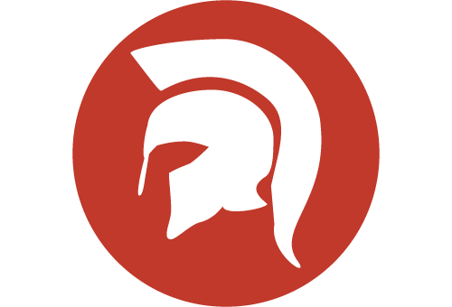

#Spartakiade 2015

Jetzt Termin reservieren.  
Die nächste Spartakiade findet am 21.–22. März 2015 in Berlin statt.

Web: http://spartakiade.org/  
Twitter: http://twitter.com/spartakiade_org  
Google+: https://plus.google.com/u/0/+Dotnet-Leipzig-DE  

# Workshop: IoT mit JavaScript von Johannes Hoppe

Inhalt: Ein Galileo Board (Arduino), das Grove Starter Kit und ganz viel JavaScript mit Node.js und AngularJS.

## Inhalt

1. [Hardware](#hardware)
2. [Software](#software)
3. [Aufgabe](#aufgabe)

## 1. Hardware

Johannes bringt folgendes Hardware-Set **einmal** mit:

1. Board: [Intel Galileo Gen 2](galileo_board.md)
2. Base Shield und Bausatz: [Seeed Studio Grove starter kit plus - Intel IoT Edition for Intel Galileo Gen 2](seeed_studio_grove_starter_intel_iot.md)

Damit lassen sich die erstellten Ideen sofort auf einem Arduino-Board ausprobieren. Idealerweise bringen möglichst viele Teilnehmer ebenso ein eigenes Hardware-Set mit, dann sinkt die Wartezeit und es steigt der Spaß-Faktor. Eine nähere Beschreibung und Links zu deutschen Online-Shops sind auf den beiden oben verlinkten Seiten zu finden. Das Hardware-Set hat einen Preis von ca. 160€ ohne Versandkosten. 

## 2. Software

Intel hat für das Galileo Board ein "Yocto 1.6" Linux vorgesehen. Auf diesem Betriebssystem lassen sich Dämons wie LighttPD and Node.js ausführen. Das Board-Boot Image wird auf eine SD-Karte kopiert kann hier herunter geladen werden:

[Boot-Image (207MB)](https://software.intel.com/sites/landingpage/iotdk/board-boot-image.html)

Anleitungen für:
* [Windows](https://software.intel.com/en-us/node/530353)
* [Mac OS](https://software.intel.com/en-us/node/530415)
* [Linux](https://software.intel.com/en-us/node/532598)

Eine 8GB SD liegt dem Starter Kit bei. Johannes wird bereits mehrere SD Karten mit Node.js vorbereitet haben.

# Intel XDK IoT Edition (Node.js)

Jeder Teilnehmer sollte bereits das "Intel XDK IoT Edition" installiert haben. Es beinhaltet eine IDE um die JavaScript-Programme (Node.js) zu entwickeln und diese auf das Board zu deployen.

Download XDK: https://software.intel.com/en-us/html5/xdk-iot
(verfügbar für Apple OS X, Microsoft Windows und Linux)

## 3. Aufgabe

In dem Workshop wird Johannes eine Einführung zu Node.js und AngularJS / Ionic Framework geben. Mit Node.js wird das Board programmiert und eine REST-Schnittstelle bereitgestellt. Mit AngularJS wird eine Companion-App für das Board realisiert. Was für eine Anwendung dabei heraus kommt, steht noch nicht fest. Ob allein oder als Team, deine Kreativität ist gefragt.    