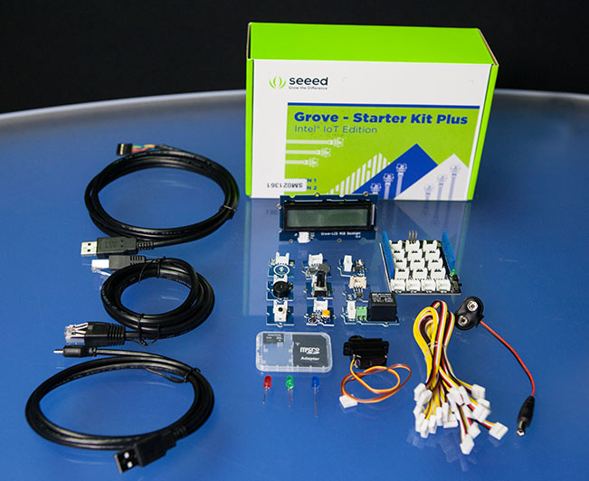

#Spartakiade 2015

## Grove Starter Kit Plus - Intel IoT Edition

Während des Workshops kommt das "Seeed Studio Grove starter kit plus - Intel IoT Edition for Intel Galileo Gen 2" zum Einsatz. Das Kit besteht aus eine Base-Shield welche den Arduino mit den Grove-Komponenten verbindet. Das Prinzip ähnelt einem Elektrobaukasten: Teile zusammenstecken und los geht es.

**Achtung: bei dem Starter Kit ist kein [Board](galileo_board.md) enthalten!**

## Inhalt

* Base Shield v2 × 1
* [Grove – Buzzer](https://software.intel.com/en-us/iot/sensor/grove-buzzer) × 1
* [Grove – Button](https://software.intel.com/en-us/iot/sensor/grove-button) × 1
* [Grove – LED](https://software.intel.com/en-us/iot/sensor/grove-led) × 1
* [Grove Rotary Angle](https://software.intel.com/en-us/iot/sensor/grove-rotatory-angle) × 1
* [Grove Sound Sensor](https://software.intel.com/en-us/iot/sensor/sound) × 1
* [Grove Smart Relay](https://software.intel.com/en-us/iot/sensor/grove-smart-relay) × 1
* [Grove – Temperature](https://software.intel.com/en-us/iot/sensor/grove-temperature) × 1
* [Grove Touch Sensor](https://software.intel.com/en-us/iot/sensor/touch) × 1
* [Grove Light Sensor](https://software.intel.com/en-us/iot/sensor/grove-light-sensor) × 1
* [Grove Mini Servo](https://software.intel.com/en-us/iot/sensor/grove-light-sensor) × 1
* [Grove LCD RGB Backlight](https://software.intel.com/en-us/iot/sensor/grove-lcd-rgb-backlight) × 1
* 8GB Micro SD Card with an SD Card Adapter × 1
* 9V to Barrel Jack Adapter 126mm × 1
* 26AWG Grove Cable **× 15**
* Micro USB Cable × 1
* Serial Cable × 1
* Ethernet Cable × 1

# Links:

* Produktinformation: [Intel® IoT Developer Kit](https://software.intel.com/en-us/iot/devkit)
* Produktinformation & Online-Shop direkt von Seeed: [Grove starter kit plus – Intel IoT Edition for Intel Galileo Gen 2](http://www.seeedstudio.com/depot/Grove-starter-kit-plus-Intel-IoT-Edition-for-Intel-Galileo-Gen-2-p-1978.html) (15% Coupon Code: 0a2e457cf9)
* Deutscher Online-Shop: [bei EXP Tech kaufen](http://www.exp-tech.de/seeed-studio-grove-starter-kit-plus-intel-iot-edition-for-intel-galileo-gen-2) (Achtung: häufig ausverkauft!)

<a href="readme.md" style="display: block; width: 115px; background: #4183c4; padding: 10px; text-align: center; border-radius: 5px; color: white; font-weight: bold; margin-top:40px;">« zurück</a>